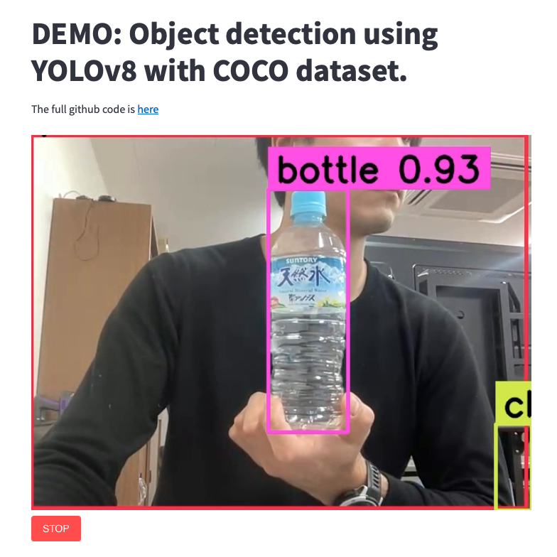
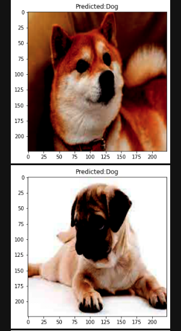

My current
<a href="pdf/SatoMario_CV_2023.pdf">CV</a>

## Blog: 
---

---
#### **2023/09:** Why do you need a buffer in your time series data.
Time series data buffer consists of the initial part and the final part of the source data that will be used to train a model. 
white-space: pre-line;
**Example:** |------|------------------------------|------|
            t0      t1   (features and labels)     t2    t3
        
The period of t0-t1 is the initial part, and the period of t2-t3 is the final part.
Buffer is necessary to be considered when the model utilizes the features and labels that is calculated using the past and future information.
For example, you can use a 180 minutes return as one of the features. However, in the very first rows of this features, the values will be NaN because you do not have a previous 180 min data.
The buffer offers that information to make the model be able to use this information. Also, the same thing applies to the label. If you are using information such as return with 180 min lookahead data, then you are considering the future data. Which is only possible because you have a final part buffer in the dataset.

---
#### **2023/09:** Difference of Supervised and Unsupervised ML models.

---
#### **2023/09:** Avoiding Overfitting in your ML model.

---
#### **2023/09:** Dealing with imbalanced data to train the model.

---
#### **2023/09:** Experiment Design in CS.

---
#### **2023/09:** Changing the OS system from Mac to Linux.

---
#### **2023/09:** Using XGBoost with hyperparameter optimized with Optuna.

---
#### **2023/09:** Why using a Random Forest classification model is better than using another model in some cases.

---
#### **2023/09:** Participating in the conference in Japan for the first time in my life.

---
#### **2023/09:** Dealing with anxiety in adult life.

---
#### **2023/09:** Changing the career path at 25 y.o.

---
#### **2023/09:** Difference between the course of Business Administration and Computer Science.

---
#### **2023/09:** Conducting a Master's research in Japan.

---
#### **2023/09:** Taking a driver license in Japan.

---
#### **2023/09:** Summary of Internship application in Japan in computer science field job.

---
#### **2023/09:** U-Net model for semantic segmentation.

---
#### **2023/09:** First steps for using github to your personal and professional projects.

---
#### **2023/09:** Basic GUI for Python.

---
#### **2023/09:** ConvNext (2020) - Overview.

---
#### **2023/09:** Experience of living as Data Scientist in Japan

---
#### **2023/09:** Introduction to Programming / Learning coding with Datacamp / Is it effective?

---
#### **2023/09:** CoAtNet (2021) - Overview.

---
#### **2023/09:** DenseNet (2016) - Overview.

---
#### **2023/09:** Dealing with Computer Vision projects X Financial predictive model.

---
#### **2023/09:** How to deal with OHLC data in pandas (python).

---
#### **2023/09:** Forex trade market: The overview.

---
#### **2023/09:** The importance of using the Raise Exception().

---
#### **2023/09:** The effects of Sprint and Scrum project management in the teamwork.

---
#### **2023/09:** How to make a basic predictive model.

---
#### **2023/09:** The importance of using the Raise Exception().

---
#### **2023/09:** Why do we need to separate the dataset for training, validation, and testing subsets?

---
#### **2023/09:** What is Data Leakage in Machine Learning (Time series data) 
In this blog, I will explain about what is Data Leakage in Time series data, how it can happen and how you can avoid this to happening in your machine learning model.
Data leakage happens in the moment of feature engineering. It consists of the introduction to the feature of the information that is not available in the moment of prediction.
For example, let's say that you want to predict if the price of a stock will go up or down. Then, you select one specific feature that contains the information of the date x+10. However, your label reflects the result of increase or decrease in the stock value of date x+5. Then you are using an information of the future that in the moment of prediction, it will not be available to you. In other words, in this case, you are including an information to the feature that you are trying to predict.
Some of the best practices to avoid data leakage are the followings:
- Split the data to train and test subsets before any type of preprocessing steps.
- Use the technique of Purging and Embargo to avoid mixing the training and testing dataset information. In other words, even if you separate the dataset to two parts, always include an 'cussion' of data that will not be used between the training and testing datasets.

  continues...

## Computer Science related Projects: 
---

#### **2023:** Deploy your Object Detection app in Streamlit using YOLOv8 model (COCO dataset) 
Github: <a href="https://github.com/mariotsato/YOLOv8_object_detection_streamlit/">HERE</a>  
DEMO in Streamlit: <a href="https://mariotsato-yolov8-object-detection-streamlit-app-9gw2rr.streamlit.app/">HERE</a> 
This is a project of object detection using YOLOv8 model with COCO dataset deployed in streamlit.
 

---
#### **2023:** Deep Learning - Cat and Dog classification with pre-trained Resnet50
Github: <a href="https://github.com/mariotsato/cat_dog_classification_resnet50">HERE</a> 
Cat and Dog classification using Jupyter Notebook (ipynb) with pre-trained Resnet50. 
 

---
#### **2022:** Deep Learning - U-Net model applied to the rope detection
Github: <a href="https://github.com/mariotsato/unet_rope_detection">HERE</a> 
A project carried on to apply the semantic segmentation to the rope detection. 
 

---
#### **2022:** For and While loop comparison
PDF: <a href="pdf/assignment_2_Sato Mario.pdf">HERE</a> 
An experiment conducted with statistical analysis of comparison between For and While loop. 
Conclusion: For loop is relatively faster to do the counting rather than using while loops. 
Check the analysis in the pdf clicking on the image. 

---
## Experiences
- [University of Tsukuba] **2022, 2023:** Research Assistant - OPERA project: LAI Index estimation using deep learning and image processing
- [University of Tsukuba] **2022, 2023:** Teaching Assistant - Introduction to Information Science
- [University of Tsukuba] **2022:** Teaching Assistant - Introduction to Programming using Python

---

Page template forked from <a href="https://github.com/evanca/quick-portfolio">evanca</a>

<!-- Remove above link if you don't want to attibute -->
