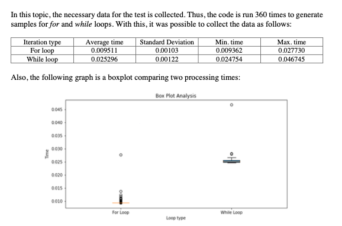
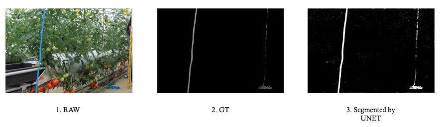

## Portfolio:

---

### 1. Data Science Projects 

#### For and While loop comparison
Experiment conducted with statistical analysis of comparison between For and While loop.
Conclusion: For loop is relatively faster to do the counting rather than using while loops.
Check the analysis in the pdf clicking on the image.

---
#### Deep Learning - U-Net model applied to the rope detection
A project carried on to apply the semantic segmentation to the rope detection.

<a href="https://github.com/mariotsato/unet_rope_detection.html/" class="image fit">Research</a></a>

---
[Deep Learning - Dog X Cat - Classification](/pdf/sample_presentation.pdf)

---
[Deep Learning - MNIST classification](http://example.com/)

---
[Machine Learning - Hire or Not](http://example.com/)

---
[Experiences]
- [University of Tsukuba] Teaching Assistant - Introduction to Information Science
- [University of Tsukuba] Teaching Assistant - Introduction to Programming using Python
- [University of Tsukuba] Research Assistant - OPERA project: LAI Index estimation using deep learning and image processing

---
### 2. Business Administration Projects

[Process Consulting - Global Link Consultoria](/sample_page)
- Project in traditional Japanese restaurant located in São Paulo
- Restaurant was facing a very difficult financial situation due to the Covid-19 Pandemic.
- In 5 months, we had a 110% growth in Revenue, operating only by Delivery and Takeaway.
- We had structured formal Marketing, Sales, Supply, Operation and Financial departments.

---
[Process Consulting - Modelos de Negocio Consultoria](/sample_page)
- As a consultant, participated in the ERP system and operation process integration project, which would strategically reduce a great part of Compliance Risk. The company was facing the transformation of familiar management to a professional management team since 2017.
  - developed the accounting solution, which reduced the annual closing time from almost 2 months to just 15 days (2019 - 2020).
  - stayed in charge of a total of 197 identified problems of Accountability, Tax, Asset management, and Cost departments. 
  - elaborated more than 30 Operational Process Handbook, 30 Operational Flows, 20 Functional Specifications, which made all the accountability processes more consistent, reducing the number of assessments in 2019.
  - conducted 6 integrated (accountability and tax) tests for the designed solution, which led to the successful implementation of those.

- As an intern, participated in the Registration project, to absorb all the process that was done by an analyst that was going to leave the firm in 1 month.
  - conducted a project to map and make more than 20 registration process (in Bizagi) and HandBooks (in Word), performing temporary absorption of activities and transferring knowledge to an analyst who would be hired later.
  - assumed a Registration department paper in a client’s firm temporally in the period that they were searching for the new registration analyst. This contributed to close a new project of Modelos de Negocio Consultoria in this company.

---
[Real Estate - Rio Bravo Investimentos](/sample_page)
- Real State Fund with more than R$ 13 Billion in its management with leadership of ex-president of Brazilian Central Bank, Gustavo Franco.
  - studied and analysed Real State Funds, Real State Cash Flow analysis, Real State KPI, prepared Presentation material.

---
[Jr. Consulting - Insper Jr. Consulting](/sample_page)
- Junior Consulting Firm of INSPER which develops students consulting skills, with more than 200 hours of capacitation.
  - was classified as one of the 5 best consultants (of total 20) of Junior Consulting Firm in its feedback system, in the 2nd bimester of work.
  - developed Artistic Coworking Business Plan with the business model, management & marketing, & operation plans.

---
### 3. Language Skills 

- Portuguese (BR) - Native
- English - TOEFL Certificate
- Japanese - JLPT N1

---

Page template forked from <a href="https://github.com/evanca/quick-portfolio">evanca</a>

<!-- Remove above link if you don't want to attibute -->
